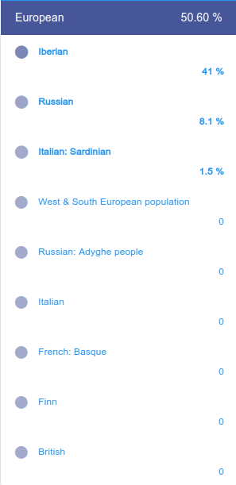
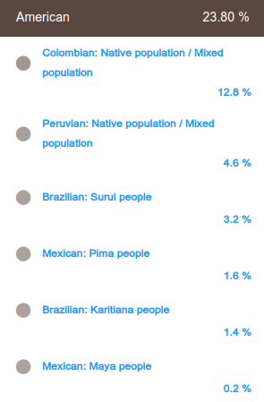
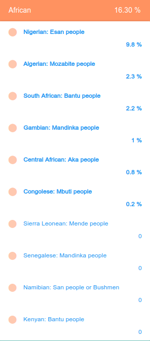
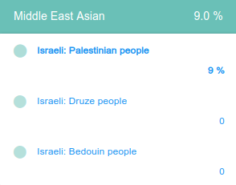
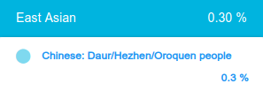

# My DNA Data for Research

This repository contains raw genomic data and ancestry visualizations for research purposes. The data is provided from two different testing services to allow for cross-referencing and comprehensive analysis.

## 🧬 Raw Data Files

| Service | Filename | Date Provided | Purpose |
| :--- | :--- | :--- | :--- |
| **TellmeGen** | [geraldo-dna-tellmegen-20190610.csv](./geraldo-dna-tellmegen-20190610.csv) | 2019-06-10 | Research & Analysis |
| **23andMe** | [geraldo-dna-23andme-20191019.csv](./geraldo-dna-23andme-20191019.csv) | 2019-10-19 | Research & Analysis |

## 🌍 Ancestry & Composition

The following results represent the genetic ancestry breakdown. Each section is collapsed to keep the document clean; click to expand.

  
<b>View Ancestry Report 1</b>

  

  
<b>View Ancestry Report 2</b>

  

  
<b>View Ancestry Report 3</b>

  

  
<b>View Ancestry Report 4</b>

  

  
<b>View Ancestry Report 5</b>

  

## 🔬 Usage for Research

These datasets are intended for:
- Bioinformatic pipeline testing.
- Ancestry composition algorithm comparisons.
- Trait and health marker identification studies.

## 📜 Disclaimer
The data provided is raw genomic information. While shared for research purposes, please handle the data with respect to the privacy considerations inherent in genetic material.
